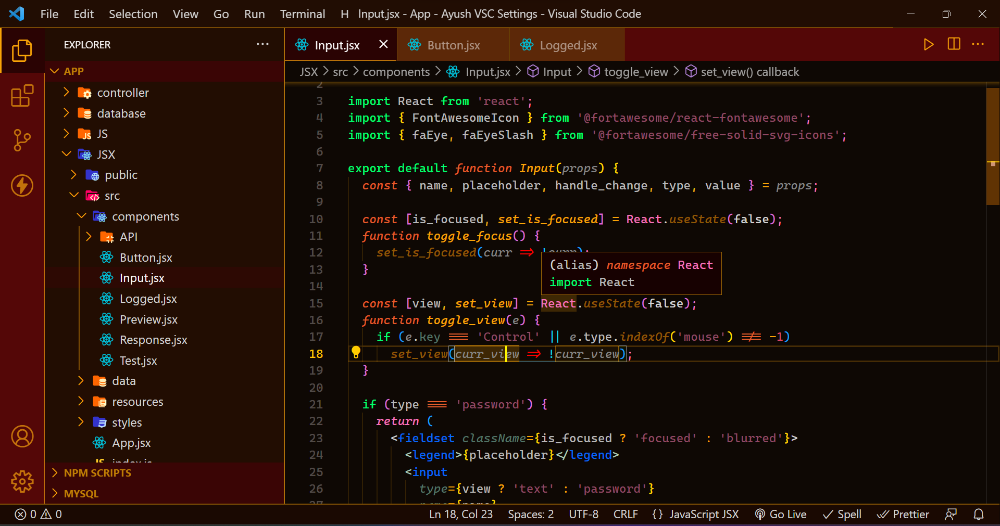
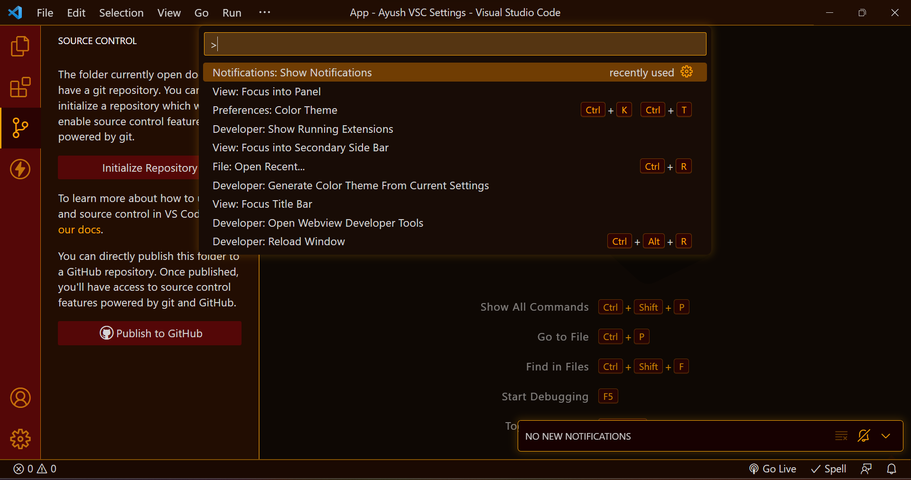

# Royal Red Theme

## Vibrant Syntax Highlighting

## Brilliant Shadows

## Installation
* Install from [VS Marketplace](https://marketplace.visualstudio.com/items?itemName=AJ-Dev.royal-red-theme)
* Press `Cmd+Shift+P` on macOS or `Ctrl+Shift+P` on Windows and Linux to open command pallet.
* Choose Preferences:Color Theme > **Royal Red Theme** to set the theme.
  
**Enjoy!**

